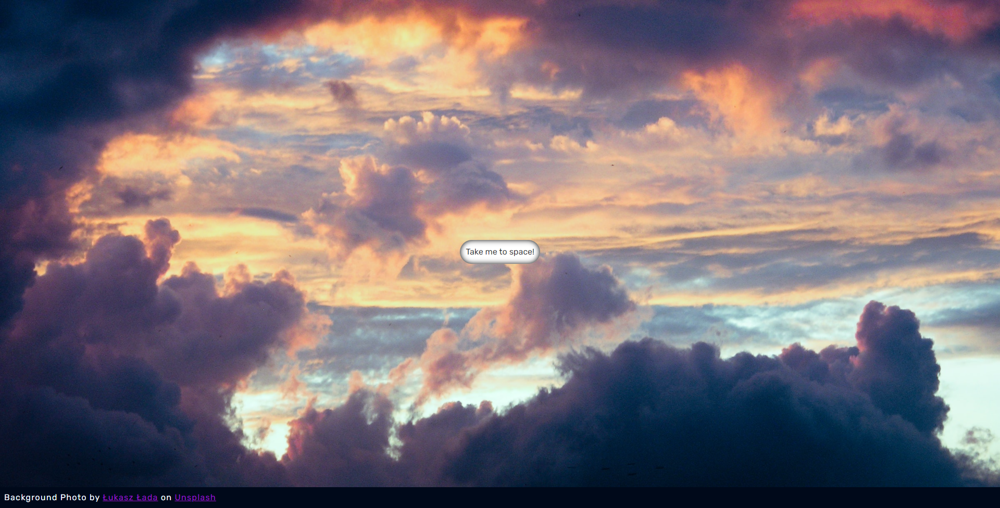
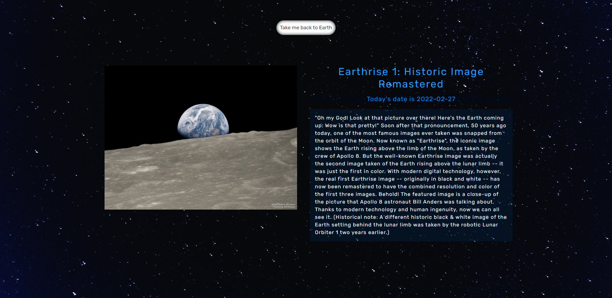

## Nasa APOD API Project

This is a project I was inspired to do when I was preparing for a job interview and realized that I had no experience with api's and working with them.

I decided to mimick the experience of a UAP (a.k.a a ufo) that takes you to space and provides you with information about space.The UAP is supposed to look similar to the tic-tac UAP that Commander David Fravor witnessed in 2004.

I watched a youtube video by [Kapehe](https://www.youtube.com/channel/UCWv30KwbtChjAZBzZ58OQww) and refactored her react-built-in fetch api code using axios. You can view the two different approaches in the NasaPic.js file.

## Technologies & Tools used:

- react
- create-react-app
- axios
- bootstrap
- react-bootstrap
- framer-motion
- react-router-dom
- sass
- react-helmet

## Pages

### Home

  

### Info Page

  <h5>The image will change every day because I am using nasa's APOD api</h3>
  

## Launch

Click on this link to see the site: https://tic-tac-uap.netlify.app/
